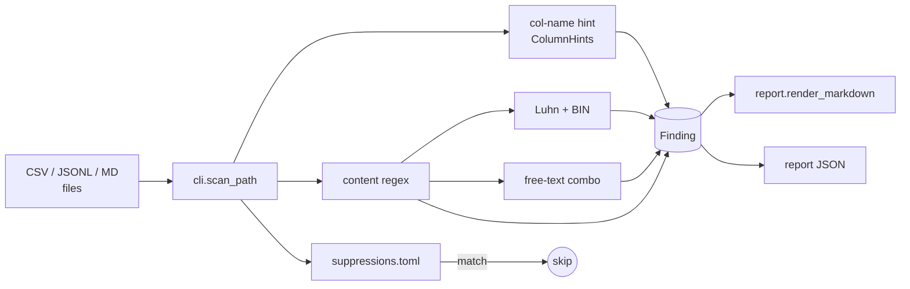
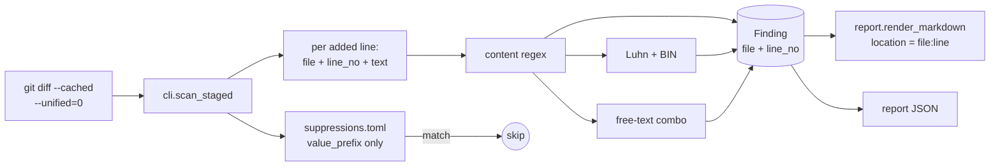
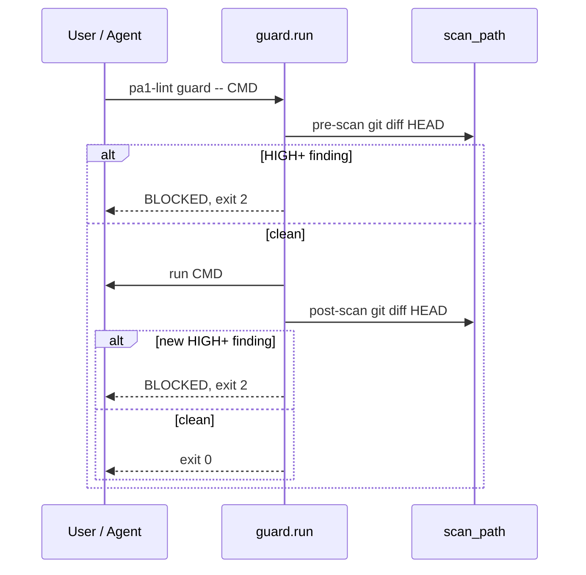

# PA1 PII Linter — Architecture

PA1 is a local-only Python scanner that flags Vietnamese PII in tabular /
markdown datasets before they leave the workstation. It is designed to wrap
two workflows:

1. `git commit` (via [pre-commit](../.pre-commit-hooks.yaml))
2. AI agent commands (Cursor / Aider / Claude Code via `pa1-lint guard --`)

## Design principles

- **Local only.** No network calls. No external services. Reads files; never
  uploads.
- **Fail-fast env check.** The CLI refuses to run if it is not inside the
  `pa1` conda environment (`exit 3`). This avoids accidental scans from
  the system Python.
- **Mask before printing.** Reporters render `evidence_masked`, never
  `evidence_raw`. The raw evidence only lives in memory.
- **Layered.** Pure detectors (no I/O) → orchestrator (CLI / guard) →
  reporters (Markdown / JSON). Each layer is independently testable.
- **Local-only suppression file.** Owned by the dataset, not the scanner.

## Data-flow



1. `cli.scan_path` walks the directory tree (CSV / JSONL / MD, depth ≤ 3).
2. For each cell value, it computes `ColumnHints` from the column header.
3. It runs detectors in order: Luhn → content regex → free-text combo.
4. Suppressions short-circuit findings whose column + value prefix + owner
   match an active entry in `suppressions.toml`.
5. Reporters render `Finding`s grouped by file. Reporters never see
   `evidence_raw`.

## Commit-time data flow (`pa1-lint scan --staged`)

This is the path the pre-commit framework uses. Instead of walking the
filesystem, the CLI parses `git diff --cached --unified=0 --no-renames`
and scans the lines introduced by the staged changes.



Highlights:
- The diff has no column header context, so `column_pattern`
  suppressions do not apply here. `value_prefix` suppressions still
  work.
- Each finding carries the cursor `file:line` so the user can jump to
  the offending line in their editor.
- Exit code `1` (HIGH) or `2` (CRITICAL) blocks the commit via the
  pre-commit framework.

## Guard flow



## Module dependency (Python)

```
pii_linter
├── __init__         (Finding, ColumnHint, ScanResult)
├── severity         (LOW/MEDIUM/HIGH/CRITICAL, SEVERITY_BY_ENTITY)
├── report            (mask_value, render_markdown)
├── suppressions     (Suppression, load_suppressions, is_suppressed)
├── cli              (entry point pa1-lint)
├── guard            (wraps subprocess with pre/post scans)
└── detectors
    ├── column_name  (score_column)
    ├── content_regex
    ├── luhn_card
    └── free_text
```

`cli` and `guard` depend on every other layer. Detectors and `report` are
pure and side-effect-free.

## Why a Python 3.11 floor?

`pa1-lint` has **zero runtime dependencies**: `tomllib` (which parses
`suppressions.toml`) and the rest of the loaders are part of Python
3.11+ stdlib. The optional `[fixture]` extra (`Faker`) is only needed
to regenerate fixtures, not to run scans.

Pinning to 3.11 means `pip install` pulls nothing else. Pinning to the
exact toolchain in `environment.yml` still gives every contributor the
same `Faker` + `pytest` versions when regenerating fixtures.

## What is NOT in slice 3

- Cross-file correlation (e.g. same phone across two files).
- Presidio integration (only used if precision becomes a problem).
- SARIF / GitHub Action output.
- Precision/recall measurement against labeled data.
- `git add` hook (Git has no `pre-add` stage; use the pre-commit hook at
  commit time instead).

See [docs/problem/PA1/PA1.md](problem/PA1/PA1.md) for the original scope.